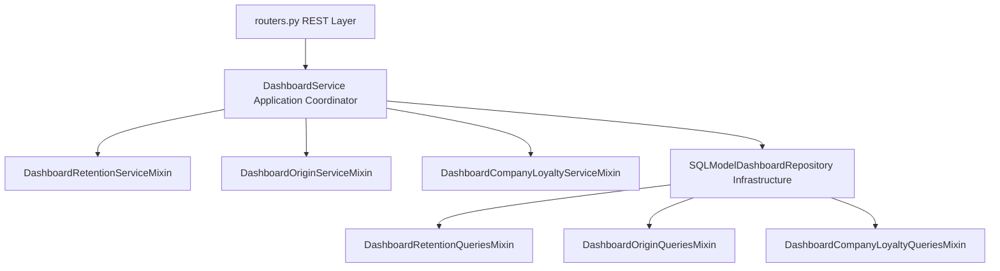

# Resumen de Cambios - Dashboards Analíticos (Labor & Company)

Este documento detalla todas las modificaciones, archivos creados e integraciones realizadas para exponer las analíticas de **Retención y Origen de Contratos Laborales (Labor)** y **Fidelidad Contractual Comercial (Company)**.

---

## 🏗️ 1. Arquitectura General y Patrón Comportamental (PEP 544)
Toda la lógica de negocio e infraestructura sigue el patrón de **Mixins de Servicio e Infraestructura**. Cada módulo analítico está desacoplado y se compone dinámicamente tanto en el repositorio como en el servicio orquestador, garantizando robustez, facilidad de mantenimiento e independencia de las pruebas unitarias.



---

## 📁 2. Detalle de Archivos Creados y Modificados

### 🔹 A. Capa de Datos (Data Transfer Objects - DTOs)
*   **Archivo Modificado:** [dto.py](file:///home/daminin/Documents/Repositorios/ContractAI-Backend/src/contractai_backend/modules/dashboard/application/dto.py)
*   **Cambios:** Implementación de esquemas Pydantic para tipado estricto y validaciones:
    *   **Labor Retention:** `RetentionKPIs`, `TenureDistributionPoint`, `MonthlyRenewalPoint`, `WorkerRetentionDetail`, `RetentionDashboardResponse`.
    *   **Labor Origin:** `OriginDistributionPoint`, `ContractOriginResponse`.
    *   **Company Loyalty:** `ClientLoyaltyKPIs`, `ClientTenureDistributionPoint`, `ClientMonthlyRenewalPoint`, `ClientLoyaltyDetail`, `CompanyLoyaltyDashboardResponse`.

### 🔹 B. Capa de Infraestructura (PostgreSQL & SQLModel)
*   **Archivos Nuevos:**
    1.  [retention.py](file:///home/daminin/Documents/Repositorios/ContractAI-Backend/src/contractai_backend/modules/dashboard/infrastructure/postgres/retention.py): Mixin de retención laboral. Agrupa trabajadores usando `coalesce` (documento + nombre) y calcula la recurrencia contractual y tasas mensuales de renovación histórica (grace period de 60 días).
    2.  [origin.py](file:///home/daminin/Documents/Repositorios/ContractAI-Backend/src/contractai_backend/modules/dashboard/infrastructure/postgres/origin.py): Mixin de origen laboral. Clasifica e identifica fuentes usando `DocumentTable.type` (Drive, OneDrive, Dropbox, Manual, o Plantillas del sistema).
    3.  [loyalty.py](file:///home/daminin/Documents/Repositorios/ContractAI-Backend/src/contractai_backend/modules/dashboard/infrastructure/postgres/loyalty.py): Mixin de fidelidad comercial B2B. Agrupa clientes mediante `coalesce` (RUC + nombre comercial) y evalúa su longevidad e intervalos contractuales en el tiempo.
*   **Archivos Modificados:**
    *   [repositories.py](file:///home/daminin/Documents/Repositorios/ContractAI-Backend/src/contractai_backend/modules/dashboard/application/repositories.py): Declaró abstractamente los métodos correspondientes para cumplir de forma estricta con el tipado estático `ty check`.
    *   [repository.py](file:///home/daminin/Documents/Repositorios/ContractAI-Backend/src/contractai_backend/modules/dashboard/infrastructure/postgres/repository.py): Compuso las 3 clases mixin dentro de la clase principal `SQLModelDashboardRepository`.

### 🔹 C. Capa de Servicio (Lógica y Seguridad RBAC)
*   **Archivos Nuevos:**
    1.  [retention.py](file:///home/daminin/Documents/Repositorios/ContractAI-Backend/src/contractai_backend/modules/dashboard/application/services/retention.py): Orquesta la retención laboral. Encamina el permiso a usuarios del área de Talento Humano (**`HR`**).
    2.  [origin.py](file:///home/daminin/Documents/Repositorios/ContractAI-Backend/src/contractai_backend/modules/dashboard/application/services/origin.py): Orquesta la distribución de origen. Restringido a rol **`HR`**.
    3.  [loyalty.py](file:///home/daminin/Documents/Repositorios/ContractAI-Backend/src/contractai_backend/modules/dashboard/application/services/loyalty.py): Orquesta la lealtad comercial de clientes. Restringido estrictamente a roles comerciales (**`MANAGER`** y **`WORKER`**).
*   **Archivos Modificados:**
    *   [service.py](file:///home/daminin/Documents/Repositorios/ContractAI-Backend/src/contractai_backend/modules/dashboard/application/services/service.py): Integró por herencia múltiple los 3 mixins dentro de `DashboardService`.
    *   [__init__.py](file:///home/daminin/Documents/Repositorios/ContractAI-Backend/src/contractai_backend/modules/dashboard/application/services/__init__.py): Re-exportó todos los nuevos DTOs analíticos.

### 🔹 D. Capa de Endpoints de API (REST API)
*   **Archivos Modificados:**
    *   [schemas.py](file:///home/daminin/Documents/Repositorios/ContractAI-Backend/src/contractai_backend/modules/dashboard/api/schemas.py): Declaró los esquemas de API HTTP heredando directamente de los DTOs de aplicación.
    *   [routers.py](file:///home/daminin/Documents/Repositorios/ContractAI-Backend/src/contractai_backend/modules/dashboard/api/routers.py): Creó y registró las 3 nuevas rutas REST GET:
        1.  `/retention/labor`: Retorna analíticas de permanencia laboral.
        2.  `/origin/labor`: Retorna procedencia de contratos de trabajo.
        3.  `/loyalty/company`: Retorna fidelidad y recurrencia de contrapartes comerciales B2B.

---

## 🧪 3. Estrategia y Suite de Pruebas Unitarias
Se crearon archivos unitarios con cobertura total para validar accesos cruzados (seguridad RBAC) y mapeos:
*   [test_dashboard_service_retention.py](file:///home/daminin/Documents/Repositorios/ContractAI-Backend/tests/dashboard/application/test_dashboard_service_retention.py) (Retención y Origen Laboral).
*   [test_dashboard_service_loyalty.py](file:///home/daminin/Documents/Repositorios/ContractAI-Backend/tests/dashboard/application/test_dashboard_service_loyalty.py) (Lealtad Comercial Company).

### Resultados de Ejecución:
Todas las pruebas de la suite de dashboards pasan correctamente en menos de 3 segundos, garantizando cero regresiones:
```bash
$ .venv/bin/pytest tests/dashboard
======================== 57 passed, 5 skipped in 2.75s =========================
```
