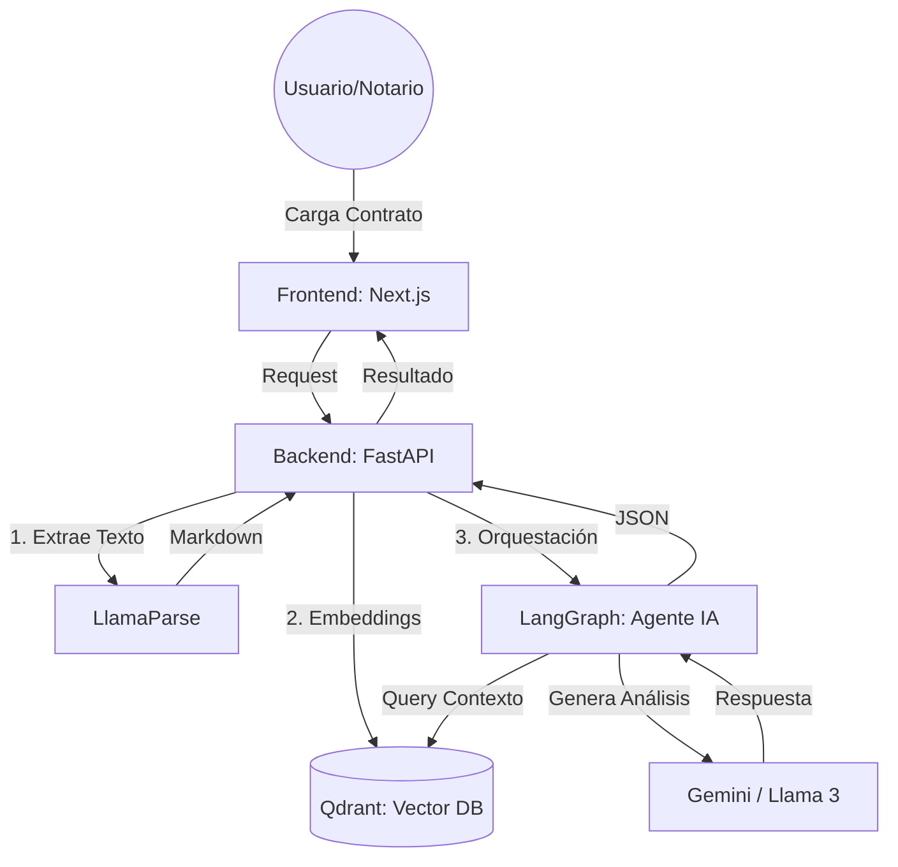

## Flujo End-to-End

## Resumen

El frontend carga el contrato y consume el backend para iniciar el pipeline. El backend orquesta parseo, embeddings y consulta contextual sobre Qdrant. LangGraph coordina la llamada al LLM y devuelve una respuesta estructurada en JSON para que el frontend la presente.
