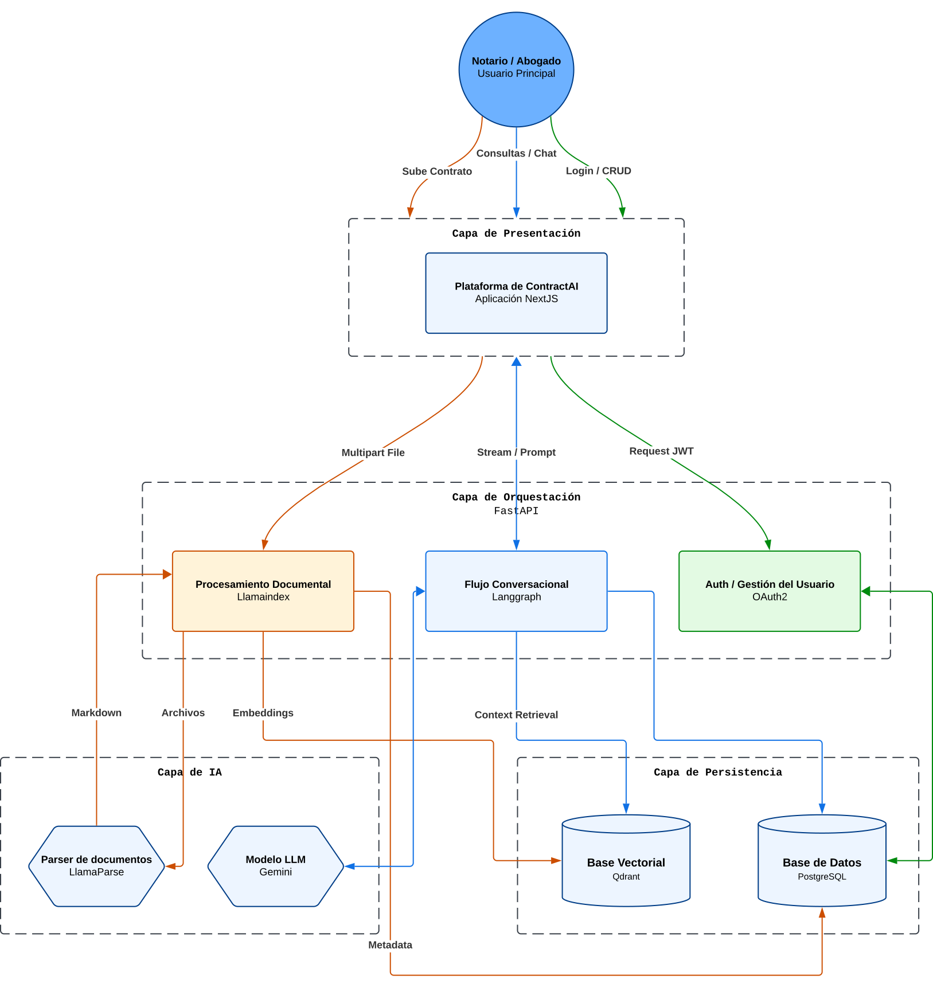

El sistema ContractIA está diseñado como una plataforma integral de análisis legal basada en Inteligencia Artificial. La arquitectura se divide en capas de responsabilidad clara para garantizar que el procesamiento de documentos legales sea preciso, seguro y escalable.

## Diagrama de la Arquitectura

A continuación se presenta el flujo de datos desde la interacción del usuario hasta la persistencia y el procesamiento de IA:

## Descripción de los Flujos de Trabajo

La arquitectura se articula a través de tres flujos operativos principales, diferenciados por su propósito y las tecnologías involucradas:

### Flujo de Ingesta y Procesamiento (Naranja)

Este flujo transforma documentos no estructurados en datos procesables para la IA:

1. **Carga de Archivo:** El usuario envía un contrato mediante un formulario `Multipart File` en la **App Next.js**.
2. **Parsing Legal:** El módulo de **Procesamiento Documental (LlamaIndex)** delega a **LlamaParse** la conversión del PDF a Markdown, preservando la estructura de tablas y cláusulas.
3. **Persistencia Dual:** Los **Metadatos** del archivo se registran en **PostgreSQL**, mientras que el contenido se fragmenta y se almacena como **Vectores** en **Qdrant** para habilitar la búsqueda semántica.

### Flujo Conversacional y RAG (Azul)

Permite la interacción en lenguaje natural sobre el contenido de los contratos:

1. **Consulta:** El usuario envía un prompt que viaja vía **Stream / Prompt** hacia el backend.
2. **Orquestación:** El **Flujo Conversacional (LangGraph)** gestiona el estado de la charla y decide cuándo recuperar información.
3. **Recuperación y Generación:** Se realiza un *Context Retrieval* desde **Qdrant** y se envía, junto al historial de **PostgreSQL**, a los modelos **Gemini** para generar una respuesta fundamentada.

### Flujo de Acceso y Seguridad (Verde)

Garantiza la integridad y privacidad de la información legal:

1. **Autenticación:** Gestión de peticiones mediante el estándar **OAuth2** y validación de **Request JWT**.
2. **Gestión de Identidad:** El módulo de **Auth / Gestión del Usuario** centraliza el login y CRUD de perfiles en la base de datos relacional.

> **Estándar Arquitectónico:** Esta visión global sigue los principios del **Modelo C4** (Nivel 2: Contenedores), facilitando la comprensión de los límites del sistema y las tecnologías empleadas.
