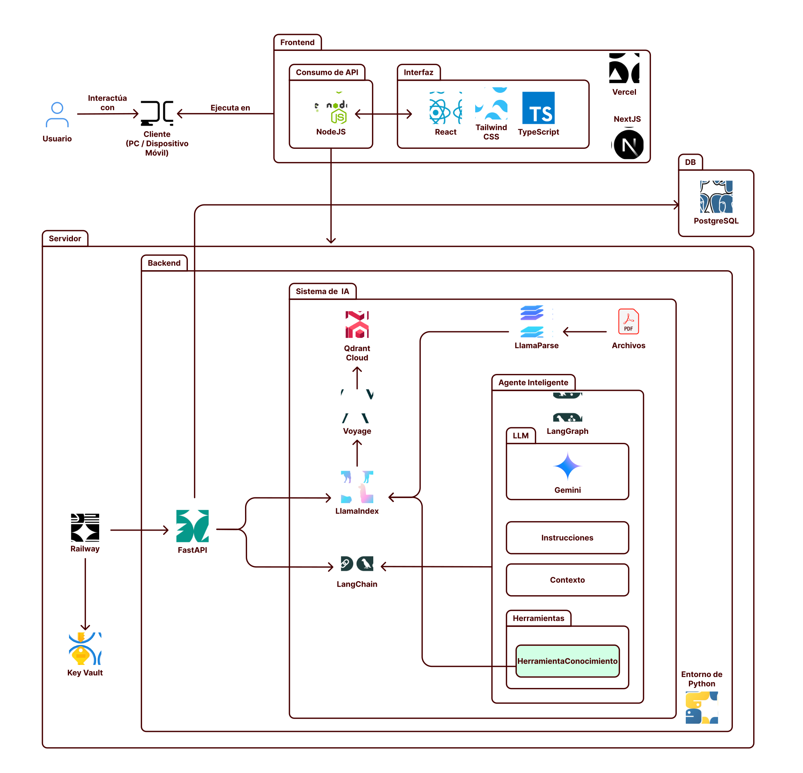

La selección de tecnologías para **Pactus** se basó en la necesidad de procesar documentos legales con extrema precisión, mantener un estado conversacional fluido y garantizar el despliegue escalable del sistema.

A continuación, se detalla la justificación técnica de cada componente de la infraestructura:

## Entorno Frontend (Vercel)

* **Next.js:** Se eligió como framework principal por su madurez en el ecosistema React. Su despliegue en **Vercel** es la decisión estratégica óptima, ya que esta plataforma ofrece la mejor integración nativa del mercado con Next.js, garantizando rendimiento, optimización de assets y CI/CD sin configuraciones adicionales.

## Entorno Backend (Docker)

* **FastAPI:** Se consolidó como la elección principal por ser uno de los frameworks más robustos, rápidos y modernos para el desarrollo de backends en Python, ideal para orquestar la concurrencia de llamadas a la IA.
* **SQLModel:** Es la opción definitiva para la capa de datos al haber sido construida específicamente para el ecosistema de FastAPI. Actualmente ofrece la mejor integración posible para manejar bases de datos, unificando la validación de Pydantic con el poder de SQLAlchemy sin fricciones.
* **LangGraph:** Se prefirió por encima del enfoque tradicional de *Agent with tools* debido a su manejo avanzado y estructurado de la memoria. Permite un control total de la persistencia del estado mediante integraciones directas como `PostgresSaver` y `PostgresStore`, guardando los hilos de conversación de forma segura en la base de datos relacional.

## Pipeline de Inteligencia Artificial

* **LlamaParse:** Es una pieza crítica para la ingesta de contratos. Se seleccionó por ser, indiscutiblemente, uno de los mejores parseadores de documentos complejos del mercado que no exige un costo inicial, permitiendo extraer tablas y jerarquías legales con alta fidelidad.
* **OpenAI (`text-embedding-3-small`):** Actualmente se usa `text-embedding-3-small` de OpenAI para generar los embeddings del texto legal. Está planificada la migración a **Voyage AI** tras una evaluación técnica comparativa que mostró una mejor relación costo-rendimiento potencial.
* **Gemini 2.5 Flash y Flash-Lite:** Siguiendo la misma directriz de optimización, estos modelos de lenguaje se integraron por su inmejorable balance de costos bajos y ventanas de contexto masivas, requisito indispensable para el análisis de contratos extensos.

## Capa de Persistencia

* **PostgreSQL:** Desplegado como base de datos relacional central. Es la tecnología que mejor se integra actualmente con los ecosistemas de IA, ofreciendo la fiabilidad necesaria para almacenar la gestión de usuarios y metadatos.
* **Qdrant Cloud:** Seleccionada por ser la base de datos vectorial más robusta y eficiente para entornos de producción, encargada de almacenar los vectores de Voyage AI y ejecutar las búsquedas semánticas de las cláusulas a alta velocidad.

### Alternativas Evaluadas y Descartadas

Para garantizar la viabilidad técnica y económica del proyecto, se evaluaron las siguientes alternativas antes de consolidar el stack final:

| Componente | Tecnología Seleccionada | Alternativa Descartada | Razón Principal del Descarte |
| :--- | :--- | :--- | :--- |
| **Extracción de Texto** | **LlamaParse** | Google Document AI | Aunque Document AI es sumamente potente para el parseado, LlamaParse ofrece resultados de altísimo nivel en la retención de jerarquías y tablas complejas, pero con una integración nativa al ecosistema RAG y sin exigir costos iniciales para arrancar el proyecto. |
| **Base de Datos Vectorial** | **Qdrant Cloud** | ChromaDB | ChromaDB es excelente para pruebas y prototipado local, pero Qdrant es indiscutiblemente la base de datos vectorial más robusta, rápida y escalable para un entorno de producción, con un filtrado por metadatos superior. |
| **Motor de Razonamiento (LLM)** | **Gemini 2.5 Flash / Lite** | GPT-4.1 Mini (OpenAI) | Se optó por Gemini por ofrecer la mejor relación de costos frente al tamaño masivo de su ventana de contexto. En el ámbito legal, es un requisito estricto poder inyectar contratos enteros en el prompt sin disparar el presupuesto. |
| **Orquestación IA** | **LangGraph** | LangChain (Agents) | El enfoque tradicional de agentes carece de control granular sobre el estado (memoria). LangGraph permite implementar flujos cíclicos complejos con persistencia nativa sólida en la base relacional usando herramientas como `PostgresSaver` y `PostgresStore`. |
| **Modelos de Embedding** | **OpenAI `text-embedding-3-small`** (actual) / **Voyage AI** (planificado) | OpenAI `text-embedding-3-small` | Actualmente se usa OpenAI por disponibilidad inmediata. Se planea migrar a Voyage AI por su mejor relación costo-rendimiento proyectada para recuperación semántica legal. |
| **ORM / Base de Datos** | **SQLModel** | SQLAlchemy puro | Requería duplicar la lógica de modelos (escribir esquemas Pydantic y modelos SQLAlchemy por separado), aumentando drásticamente la fricción y el tiempo de desarrollo en FastAPI. |
