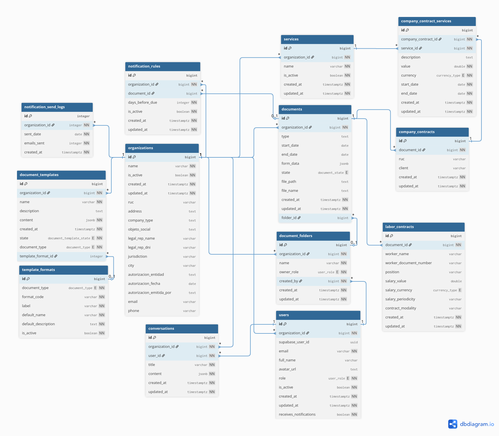

Este documento resume la estructura relacional actual de **ContractIA** en Supabase.

## MER

La imagen del MER puede actualizarse por separado. La vista textual y las relaciones listadas a continuación reflejan el esquema vigente del producto.

## Vista Conceptual de Relaciones

  <pre style="display: inline-block; text-align: left; white-space: pre; overflow-x: auto;"><code>                    auth.users
                        |
                        | relacion logica: public.users.supabase_user_id
                        v
                  public.users ---------> public.conversations
                      |
                      +-----------------> public.document_folders
                      |
                      v
                public.organizations
          +------------+-----------+-----------+-----------+-----------+
          |            |           |           |           |           |
          v            v           v           v           v           v
    public.documents  public.services  public.document_templates  public.notification_rules  public.notification_send_logs
          |                |                     ^
          |                |                     |
          v                +-------> public.documents_services
    public.document_folders

    public.template_formats --------> public.document_templates
    public.documents --------------> storage.objects (relacion por file_path)
  </code></pre>

## Relaciones Principales

### `organizations` -> tablas del dominio

`public.organizations` es la raíz del tenant. Desde ahí se referencian:

- `users`
- `documents`
- `services`
- `conversations`
- `document_templates`
- `notification_rules`
- `document_folders`
- `notification_send_logs`

### `users` -> `conversations`

Cada conversación pertenece a un usuario y a una organización. El historial visible se conserva en `public.conversations.content` como `jsonb`.

### `users` -> `document_folders`

Cada carpeta registra en `created_by` el usuario que la creó. Esto permite mostrar autoría y aplicar reglas de gestión por rol.

### `documents` -> `document_folders`

La relación es opcional mediante `documents.folder_id`. Un contrato puede quedar sin carpeta o asignarse a una carpeta visible para el rol propietario de esa carpeta.

### `documents` -> `documents_services`

`documents_services` es una tabla intermedia enriquecida. No solo enlaza un documento con un servicio, sino que también persiste:

- descripción de la línea
- valor monetario
- moneda
- fechas propias de esa línea contractual

### `services` -> `documents_services`

Un servicio del catálogo puede aparecer en varios contratos. Esto evita redefinir el mismo concepto contractual en cada documento.

### `template_formats` -> `document_templates`

Una plantilla puede apuntar opcionalmente a un formato mediante `template_format_id`. Este catálogo separa el tipo documental (`document_type`) del formato funcional concreto (`format_code`).

### `notification_rules` -> `documents`

`notification_rules.document_id` es opcional:

- si tiene valor, la regla aplica a un contrato específico
- si es `null`, funciona como regla por defecto de la organización

### `notification_send_logs` -> `organizations`

Esta tabla registra cuántos correos consolidados se enviaron por organización en una fecha dada. Su objetivo es evitar reenvíos duplicados del cron diario.

### `auth.users` -> `public.users`

La relación entre autenticación y dominio es lógica, no física:

- `auth.users.id` representa la identidad administrada por Supabase
- `public.users.supabase_user_id` representa el perfil funcional dentro del producto

### `documents` -> `storage.objects`

No hay foreign key física entre negocio y Storage. La aplicación enlaza ambas capas usando:

- `public.documents.file_path`
- `public.documents.file_name`
- bucket `documents`

### `notification_rules` + `documents` -> `sync_document_states()`

La función `public.sync_document_states` recalcula el estado persistido de los contratos tomando en cuenta:

- `documents.end_date`
- el estado actual del documento
- las reglas activas por contrato
- las reglas activas por organización

Es una pieza importante del modelo porque convierte reglas y fechas en un estado persistido de negocio.

## Lectura Correcta del Modelo

Para interpretar bien la base de datos conviene separar tres niveles:

| Nivel | Dónde vive | Qué resuelve |
|------|------------|--------------|
| Identidad | `auth.*` | Login, sesiones y proveedor OAuth |
| Negocio | `public.*` | Organizaciones, usuarios, contratos, plantillas, carpetas y notificaciones |
| Archivos | `storage.*` | Binarios documentales y metadatos de objetos |

Esta documentación mantiene el MER enfocado en el dominio transaccional del producto y en sus relaciones directas con Auth y Storage.
